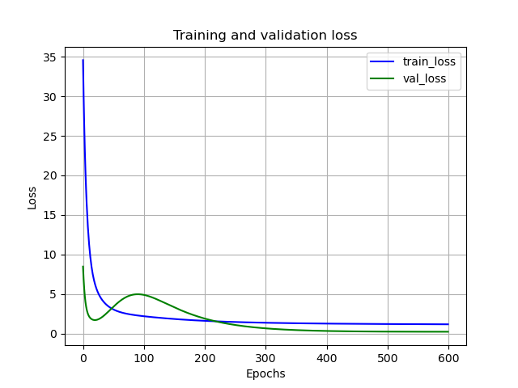

Let's develop a benchmark linear regression model using the data prepared in <a href="2024-03-01-data-preparation-for-stress-testing-model-part-1.md">part 1</a> and sequence preparation functions created in <a href="2024-03-01-data-preparation-for-stress-testing-model-part-2.md">part 2</a>. Note that we don't really need to structure the data into sequences with three-dimensional `(batch_size, sequence_size, data_size)` tensors for linear regression. We could have only used the `(batch_size, data_size)` shape. However, we will use the three-dimensional tensors with `sequence_size = 1` to establish a framework for sequence-to-sequence models.

We will start by loading the libraries:

```Python3
import pandas as pd
import torch
import matplotlib.pyplot as plt
from make_sequences import *
from torch_seed import *
```

The libraries `make_sequences` and `torch_seed` can be found in the <a href="../Code">`Code`</a> directory of this repository.

Next, we read the data, define the x and y variables, and split the data into the training and test sets:

```Python3
x_columns = ['real_disp_inc_growth', 'real_gdp_growth', 'cpi_inflation_rate',
             'spread_treasury_10y_over_3m', 'spread_treasury_5y_over_3m',
             'treasury_3m_rate_diff', 'treasury_5y_rate_diff', 'treasury_10y_rate_diff',
             'bbb_rate_diff', 'mortgage_rate_diff', 'vix_diff',
             'dwcf_growth', 'hpi_growth', 'crei_growth',
             'q1', 'q2', 'q3', 'q4']
y_columns = ['unemployment_rate']
x_size = len(x_columns)
d_train = d.iloc[:-4]
d_test = d.iloc[-4:] # last 4 quarters are for testing
```

In theory, we need a separate validation set to control overfitting and perform hyperparameter tuning, however, since the data is short, we will reuse the test set as a validation set.

Now, let's structure the training and testing data to use for model training:

```Python3
set_all_seeds(1) # ensure the prepared data and overall results are reproducible
xy_train = create_batched_sequences(d_train[x_columns], d_train[y_columns],
                                    sequence_lengths = [1], batch_size = 4)
xy_test = create_batched_sequences(d_test[x_columns], d_test[y_columns],
                                   sequence_lengths = [1], batch_size = 4)
```

The x variables in the training/testing data are formatted into a `(4, 1, x_size)` shape, where 4 is the batch size, 1 is the sequence length (essentially each observation is considered independently of its previous ones), and `x_size` is the number of x variables (features). Similarly, the y variable is formatted into a `(4, 1, 1)` shape where the last dimension is 1 since we predict only the unemployment rate.

We will use the PyTorch framework to define a shallow neural network for a linear regression model:

```Python3
class LinearModel(torch.nn.Module):
    def __init__(self, x_size):
        super(LinearModel, self).__init__()
        self.linear = torch.nn.Linear(in_features = x_size, out_features = 1)
    
    def forward(self, x):
        out = self.linear(x)
        return out
```

We could have created a linear regression model directly using  `torch.nn.Sequential`, however, again, to build up the framework for sequence-to-sequence models, we use a slightly longer subclassing approach. The `LinearModel` class defined above is derived from `torch.nn.Module` which is a base class for all PyTorch models. In the constructor of the `LinearModel` class, we create a linear layer with `x_size` inputs and 1 output.

The `forward` function of the class performs forward pass. It only calls the linear layer to perform `W*x+b` operation where `W` and `b` are learnable (trainable) parameters.

The `Linear` layer is flexible with regards to the number of dimensions in input x. It only requires the size of the last dimension to be equal to the number of input features which is `x_size` in our case. In the prepared training data, each tensor x has a shape `(4, 1, x_size)`, so the `Linear` layer  will apply `W*x+b` operation to each of the four input vectors and will output a tensor of shape `(4, 1, 1)` which matches to the shape of the y tensor of the training data.

To train the model, we need to create a loss function, and an optimizer:

```Python3
model = LinearModel(x_size)
loss_fn = torch.nn.MSELoss() # Mean Squared Error (MSE)
optimizer = torch.optim.Adam(model.parameters(), lr = 0.001)
n_epochs = 600
```

Next, we define two functions to train and test the model.

```Python3
def train_epoch(xy_train, model, loss_fn, optimizer):
    model.train(mode = True) # switch to the training mode to calculate the gradients
    total_loss = 0.0
    for x, y in xy_train:
        model.zero_grad()
        y_hat = model(x) # predict with the current model
        loss = loss_fn(y_hat, y) # calculate the loss (error) for the prediction
        loss.backward() # backpropagation - calculates gradients
        optimizer.step() # update parameters to reduce the loss
        total_loss += loss.item()
    total_loss /= len(xy_train)
    return total_loss

def test_epoch(xy_test, model, loss_fn):
    model.train(mode = False) # switch to evaluation mode, do not calculate gradients
    total_loss = 0.0
    for x, y in xy_test:
        y_hat = model(x) # predict with the current model on the test data
        loss = loss_fn(y_hat, y) # calculate the loss (error) for the prediction
        total_loss += loss.item()
    total_loss /= len(xy_test)
    return total_loss
```

These two functions will be called at each epoch of the training procedure defined below:

```Python3
def train_model(xy_train, xy_test, model, loss_fn, optimizer, n_epochs):
    train_losses = []
    test_losses = []
    for epoch in range(n_epochs):
        train_loss = train_epoch(xy_train, model, loss_fn)
        test_loss = test_epoch(xy_test, model, loss_fn)
        # Keep track of the train and test losses
        train_losses.append(train_loss)
        test_losses.append(test_loss)
        train_loss, test_loss = round(train_loss, 3), round(test_loss, 3)
        print(f'Epoch {epoch}, train loss - {train_loss}, test loss - {test_loss}')
    return train_losses, test_losses
```

The classical method for finding the optimal parameters of a linear model is the ordinary least squares (OLS). Here, we used gradient descent instead since we aim to establish a framework for sequence-to-sequence models.

The model training function returns training and testing losses for each epoch. They are useful to assess how well the model is trained and if there is any evidence of overfitting or underfitting. We define a function to plot the training and testing losses:

```Python3
def plot_loss_history(train_losses, val_losses):
    plt.plot(train_losses, label = 'train_loss', color = 'blue')
    plt.plot(val_losses, label = 'val_loss', color = 'green')
    plt.legend()
    plt.title('Training and validation loss')
    plt.xlabel('Epochs')
    plt.ylabel('Loss')
    plt.grid()
    plt.show()
```

Now let's train the model and plot the losses:

```Python3
train_losses, test_losses = train_model(xy_train, xy_test, model, loss_fn, optimizer, n_epochs)
plot_loss_history(train_losses, test_losses)
```

Training output (we show only a few first and last epochs):

```
Epoch 0, train loss - 34.573, test loss - 8.466
Epoch 1, train loss - 30.097, test loss - 6.877
Epoch 2, train loss - 26.357, test loss - 5.652
Epoch 3, train loss - 23.218, test loss - 4.718
Epoch 4, train loss - 20.58, test loss - 4.009
...
Epoch 595, train loss - 1.166, test loss - 0.224
Epoch 596, train loss - 1.166, test loss - 0.224
Epoch 597, train loss - 1.165, test loss - 0.224
Epoch 598, train loss - 1.165, test loss - 0.224
Epoch 599, train loss - 1.165, test loss - 0.223
```

And here is the plot for training and test (the same as validation) loss:



The training output and the chart show that both training and test loss curves are flattened at the end of the training which means that the linear model cannot improve any further with the given settings. Note that we may achieve a lower loss by trying out different learning rates (`lr` parameter in `torch.optim.Adam`) and batch sizes (`batch_size` parameter in `create_batched_sequences`). We will look into hyperparameter tuning in a later post.

Now let's predict the unemployment rate for the entire historical data. For this exercise, we need to preserve the chronological order of the observations since we want to plot the predictions. To achieve this, we will create a sequence of input vectors that contains both the training and testing sets. We will use `create_fixed_length_sequences` function to create a `(1, n, x_size)` tensor, where the first dimension is the batch size (a batch of one long sequence with the entire history), `n` is the length of the historical data, and `x_size` is the number of x variables as before.

```Python3
# Create one long array (train + test) and predict with it
model.train(mode = False)
x_all = create_fixed_length_sequences(d[x_columns], sequence_length = d.shape[0])[0] # take the first and only tensor from the returned list
y_all = model(x_all)
y_all = y_all[0, :, 0].detach().numpy()
```

Given the `(1, n, x_size)` tensor of x variables, the model returns the prediction in a `(1, n, 1)` tensor. We converted the latter into a one-dimensional numpy array. Finally, we put together the historical and predicted unemployment rates in one plot:

```Python3
d_all = d[['date'] + y_columns].copy()
d_all['pred'] = y_all
d_all.plot(x = 'date', y = ['unemployment_rate', 'pred'], grid = True, rot = 45, xlabel = '', title = 'Model fit')
plt.tight_layout()
plt.show()
```


The last four quarters in the model fitting plot are from the test set, the rest are from the training set. To summarize, the training loss (MSE) for the linear regression is `1.165`, and the test loss is `0.223`. In the next post, we will try to beat this with an LSTM model.

Before looking into more sophisticated models, let's compare the linear model's forecasts against Fed-provided unemployment rate scenarios. A gentle reminder, that our forecast is conditional (not one step ahead forecast), which means that given the series of all other macroeconomic series, we predict the unemployment rate series.

```Python3
# Scenario prediction
from predict_scenarios import *

# These are preprocessed scenario files (see part 1 blog)
scenario_files = {'Base': '../Data/Base_data_processed_2024.csv',
                  'SA': '../Data/SA_data_processed_2024.csv'}
# Load scenario files into a dictionary
d_scenarios = load_scenarios(scenario_files, start_date = '2024 Q1')
# Predict with scenarios
d_forecast = predict_scenarios(d_scenarios, x_columns, y_columns, model)
# Plot each scenario
plot_scenario_forecasts(d_forecast, y_label = 'Unemployment rate')
```

Here are the plots for FRB and linear model predicted unemployment rates for each scenario:


The linear model prediction for the base scenario has a weird uptrend. In the severely adverse scenario, the linear model prediction is overall lower and the hump is muted compared to the FRB scenario. Let's see if we can produce a better forecast with an LSTM model.
