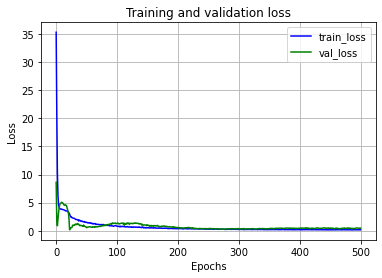
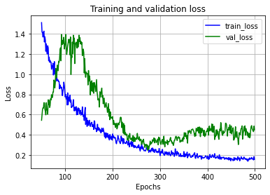
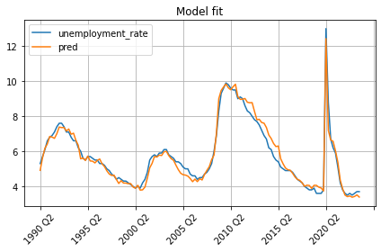
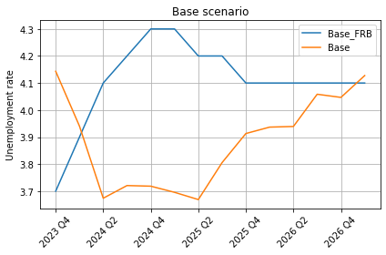
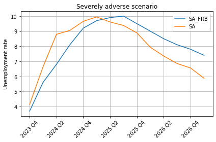

In the previous post, we developed a <a href="2024-03-21-benchmark-linear-regression-for-stress-testing.md">linear model</a> which didn't perform well. Now let's build an LSTM-based model to see if we can achieve a better performance. As before we will predict the unemployment rate given all other variables.

The main advantage of LSTM is that it has a state where it stores relevant information from past periods. Then it uses the state and new inputs to predict the current period. We will not cover the inner structure of the LSTM cell here (there are plenty of materials available on the web) but rather will use it as a building block in the model.

Along with LSTM, we will need a few other building blocks for the model which are described below:

1. Batch normalization: LSTM works better when the data is normalized or standardized. We will normalize the continuous variables using a `torch.nn.BatchNorm1d` layer. We will exclude the one-hot encoded `q1`, `q2`, `q3`, and `q4` variables from normalization.

   The `torch.nn.BatchNorm1d` layer normalizes the second dimension of the input tensor. On the other hand, since our data is structured into `(batch_size, sequence_size, x_size)` tensors, we need to normalize the third dimension. To align with the `torch.nn.BatchNorm1d`, we will swap the order of the second and the third dimensions using the `torch.permute` function, and then after batch normalization, we will change them back.

2.  Concatenation: After normalizing the continuous variables, we will concatenate them with the one-hot encoded variables to form a single tensor.

3.  LSTM layer: The data prepared in the previous step will be fed into a two-layer LSTM module. We will set the size of the LSTM state vector to 10. The output size of the LSTM layer is the same as its state's vector size, i.e. 10. We will apply dropout to the first LSTM layer to reduce overfitting.

4.  Dropout: We will apply another dropout to the output of the second LSM layer to further regularize the network.

5.  Output: We will apply a linear layer to transform the output of the LSTM layer into a one-dimensional sequence.

Now let's start the coding by importing the libraries. The custom libraries can be found in the <a href="../Code">`Code`</a> directory of this repository.

```Python3
import pandas as pd
import torch
import matplotlib.pyplot as plt
# All custom libraries can be found in Code directory
from make_sequences import *
from torch_seed import *
from model_training import *
```

Next, let's define a class that implements an LSTM-based sequence-to-sequence model based on the description above:

```Python3
class LSTMSequence(torch.nn.Module):
    def __init__(self, x_size, lstm_size, dropout_rate):
        super(LSTMSequence, self).__init__()
        self.batch_norm = torch.nn.BatchNorm1d(x_size - 4)
        self.lstm = torch.nn.LSTM(input_size = x_size, hidden_size = lstm_size,
                                  num_layers = 2, batch_first = True,
                                  dropout = dropout_rate)
        self.dropout = torch.nn.Dropout(p = dropout_rate)
        self.linear = torch.nn.Linear(lstm_size, 1)
        #self.linear = torch.nn.utils.parametrizations.weight_norm(self.linear)
    
    def forward(self, sequence):
        # sequence size is (batch_size, sequence_size, x_size)
        x1 = sequence[:, :, :-4] # continuous variables
        x2 = sequence[:, :, -4:] # one-hot encoded variables: q1, q2, q3, and q4
        x1 = torch.permute(x1, (0, 2, 1)) # change to (batch_size, x_size, sequence_size)
        x1 = self.batch_norm(x1) # normalize the continuous variables
        x1 = torch.permute(x1, (0, 2, 1)) # change back to (batch_size, sequence_size, x_size)
        x = torch.cat([x1, x2], dim = 2) # concatenate continuous and one-hot encoded variables
        x, _ = self.lstm(x) # use only LSTM ourput, ignore the retured state
        x = self.dropout(x) # apply dropout
        out = self.linear(x) # final layer to create output with a shape (batch_size, sequence_size, 1)
        return out
```

The constructor of the class creates all the modules we need using the number of input variables (`x_size`), LSTM state size (`lstm_size`), and dropout rate (`dropout_rate`) which it receives as arguments. The `forward` function takes a three-dimensional tensor (a batch of sequences of x vectors) and runs through the transformations and layers.

Let's load and prepare the data for the model. We will use a preprocessed file that we created in part 1 of the <a href="2024-03-01-data-preparation-for-stress-testing-model-part-1.md">data preparation</a> post:

```Python3
d = pd.read_csv('../Data/historical_data_processed_2024.csv')

x_columns = ['real_disp_inc_growth', 'real_gdp_growth', 'cpi_inflation_rate',
             'spread_treasury_10y_over_3m', 'spread_treasury_5y_over_3m',
             'treasury_3m_rate_diff', 'treasury_5y_rate_diff', 'treasury_10y_rate_diff',
             'bbb_rate_diff', 'mortgage_rate_diff', 'vix_diff',
             'dwcf_growth', 'hpi_growth', 'crei_growth',
             'q1', 'q2', 'q3', 'q4']
y_columns = ['unemployment_rate']
x_size = len(x_columns)
d_train = d.iloc[:-4]
d_test = d.iloc[-4:] # last 4 quarters are for testing

set_all_seeds(1) # ensure the prepared data and overall results are reproducible
# Create sequences of multiple lengths to have more training data
xy_train = create_batched_sequences(d_train[x_columns], d_train[y_columns],
                                    sequence_lengths = [2, 4, 6], batch_size = 4)
xy_test = create_batched_sequences(d_test[x_columns], d_test[y_columns],
                                   sequence_lengths = [4], batch_size = 1)
```

Since the historical data is small (only 136 observations), we created sequences with multiple lengths to augment the training data. Each batch contains sequences of the same length.

Now it is time to train the model:

```Python3
model = LSTMSequence(x_size, lstm_size = 10, dropout_rate = 0.1)
loss_fn = torch.nn.MSELoss() # Mean Squared Error (MSE)
optimizer = torch.optim.Adam(model.parameters(), lr = 0.001)
n_epochs = 500 # 300 seems better

train_losses, test_losses = train_model(xy_train, xy_test, model, loss_fn, optimizer, n_epochs)
plot_loss_history(train_losses, test_losses)
plot_loss_history(train_losses, test_losses, start_epoch = 50)
```

We made two plots for the loss function: one showing the full history, and the second starting from the 50th epoch to zoom in into the long tail to the right.




We can see from the second chart that the validation loss is worsening after around 300 epochs which is a sign of overfitting. So we will retrain the model for only 300 epochs to avoid overfitting (i.e. rerun the code above with `n_epochs = 300`.)

Below is the truncated output of the training with 300 epochs:

```
Epoch 0, train loss - 35.322, test loss - 8.618
Epoch 1, train loss - 21.245, test loss - 1.655
Epoch 2, train loss - 10.325, test loss - 0.876
...
Epoch 297, train loss - 0.23, test loss - 0.378
Epoch 298, train loss - 0.266, test loss - 0.351
Epoch 299, train loss - 0.233, test loss - 0.37
```

The training loss of the LSTM model is much better than the training loss of the linear regression model, 0.233 vs 1.165. However, the test loss is slightly worse, 0.37 vs 0.223. We may be able to improve the test loss by trying different batch sizes and learning rates. We may explore this in another post.

Now let's check how well the model fits the training and test data:

```Python3
# Create one long array (train + test) and predict with it
model.train(mode = False)
x_all = create_fixed_length_sequences(d[x_columns], sequence_length = d.shape[0])[0]  # take the first and only tensor from the returned list
y_all = model(x_all)
y_all = y_all[0, :, 0].detach().numpy() # Convert (batch_size, sequence_size, x_size) tensor to an array of sequence_size

# Plot the actual and prediction
d_all = d[['date'] + y_columns].copy()
d_all['pred'] = y_all
d_all.plot(x = 'date', y = ['unemployment_rate', 'pred'], grid = True, rot = 45, xlabel = '', title = 'Model fit')
plt.tight_layout()
plt.show()
```



The LSTM model has a much better fit than the linear model but is slightly underpredicting on the test set (the last 4 quarters.)

Now let's see how the model performs in base and severely adverse scenarios:

```Python3
# Scenario prediction
from predict_scenarios import * # can be found in Code directory

# These are preprocessed scenario files (see part 1 blog)
scenario_files = {'Base': '../Data/Base_data_processed_2024.csv',
                  'SA': '../Data/SA_data_processed_2024.csv'}
# Load scenario files into a dictionary
d_scenarios = load_scenarios(scenario_files, start_date = '2023 Q4') # starting from an earlier date to warm up LSTM state
# Predict with scenarios
d_forecast = predict_scenarios(d_scenarios, x_columns, y_columns, model)
# Plot each scenario
plot_scenario_forecasts(d_forecast, y_label = 'Unemployment rate')
```





The base forecast is perhaps slightly better than the linear regression since the LSTM model prediction is around the FRB curve. The severely adverse forecast is much better than the linear regression since the LSTM model closely tracks the FRB curve and has a similar hump shape.

Besides the LSTM-based model, we may try the GRU-based model which has a very similar structure to LSTM but is slightly simpler. The complete code for both LSTM and GRU models can be found in <a href="../Code">`Code`</a> directory of this repository.
