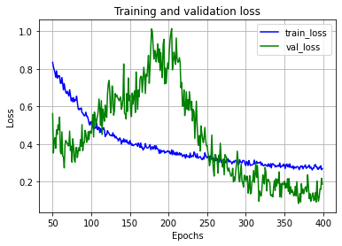
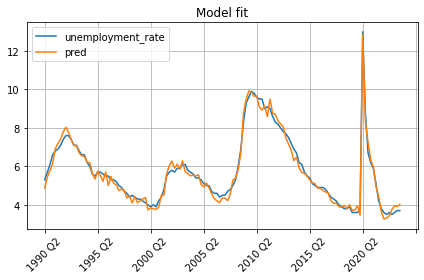

In the previous post, we developed an <a href="2024-03-31-LSTM-based-sequence-to-sequence-model.md">LSTM-based model</a> which performed remarkably well compared to the benchmark <a href="2024-03-21-benchmark-linear-regression-for-stress-testing.md">linear model</a>. Now let's build an attention-based time-series model to see if we can further improve the performance. As before, we will predict the unemployment rate given all other variables.

The idea of using the attention mechanism for this problem is inspired by language translation models. At a very high level, a translation model (such as from English to Chinese) converts words both in source and target languages into high-dimensional vectors called embeddings, builds a context vector by comparing the projections of the target embeddings with the projections of the source embeddings, then predicts the next word in the target language using the context vector.

The context vector represents the relevant information to predict the next word. This idea is conceptually similar to the hidden state of the LSTM (or GRU) cell. However, the context vector is more flexible since it can directly consume information from a much wider set of data points, while LSTM can use only the current input data point and the previous hidden state.

In our problem, we are given a time series of $x_t$ vectors representing macroeconomic variables at each time step $t$ and need to predict a one-dimensional time series $y_t$ of the unemployment rate. Since $y_t$ is one-dimensional, it doesn't make sense to take projections of it (and compare them to $x_t$ projections.) Instead, we will take $x_t$ projections and compare them with projections of past periods $x_{t - 1}$, $x_{t - 2}$, etc. to build the context vector. The latter represents the information from the current and past periods that can be helpful to predict $y_t$.

When we compare $x_t$ projections with its past projections, this type of attention is called self-attention. Note that in language translation models it is usual to compare against both past and future values to build a better context. However, we can only look back in time series to avoid data leaks.

Not let's go over the steps to build the model:

1. Batch normalization: The attention mechanism works better when the data is normalized. We will normalize the continuous variables using a `torch.nn.BatchNorm1d` layer. We will exclude the one-hot encoded `q1`, `q2`, `q3`, and `q4` variables from normalization.

2. Positional encoding: The context vector built by the attention mechanism is based on a weighted average of past input projections. As such, attention does not account for the order of the past inputs. The general approach in large language models (LLMs) is to add sine and cosine-based encoding vectors to the input vectors (embeddings) to address this deficiency.

   However, in our problem, since the length and dimensionality of the input sequences are much smaller, we will append a feature to the sequences to encode the position. Note that the one-hot encoded `q1`, `q2`, `q3`, and `q4` variables are not so efficient for positional encoding since the look-back window of the attention mechanism can be much longer than 4.

3. Reduce the input dimensionality: This optional step aims to reduce the dimensionality of the input vectors to a number with many multipliers. This provides more flexibility in selecting the number of attention heads since PyTorch requires the embedding size to be divisible by the number of attention heads.

4. Multihead attention: This layer implements the attention mechanism. It takes three sequences as inputs: queries, keys, and values, then returns a sequence of context vectors. We will set all three inputs to the same sequence obtained from the previous step.

   At each time step the attention layer can only attend to past observations as we forecast a time series. To enforce this, we need to pass an attention mask. The latter is a boolean matrix of `sequence_length x sequence_length` where for each `i`-th row the above diagonal elements are `True` indicating that they are masked (should not be attended).

5. Residual connection: At this step, we add the input of the attention layer (from step 3) to the output of the attention layer. This operation is called residual connection. It ensures that the information in the input flows through the rest of the network in addition to the context vectors created by the attention layer. Note that the input and the output of the attention layer have the same dimensionality.

7. Feed-forward: Finally, we use a feed-forward network to process the sequences from the previous step and output the final prediction. This block consists of a dropout step, a linear layer, non-linear activation (ReLU), and another linear layer which reduces the output dimensionality to one.

Traditional LLMs use layer normalization after the residual connection. In our experiments, we found that the model performs better without layer normalization. We left a couple of lines commented out in case the reader wants to experiment with the layer normalization.

Let's start the coding by importing the required modules:

```Python3
import pandas as pd
import torch
import matplotlib.pyplot as plt
# All custom libraries can be found in Code directory
from make_sequences import *
from torch_seed import *
from model_training import *
from predict_scenarios import *
```

Now let's define the class for the self-attention model. We will start with the class constructor:

```Python3
class SelfAttentionSequence(torch.nn.Module):
    def __init__(self, x_size, embed_size, num_heads, dropout_rate, max_sequence_size = 50):
        super(SelfAttentionSequence, self).__init__()
        # batch normalization of inputs excluding q1, q2, q3, and q4
        self.batch_norm = torch.nn.BatchNorm1d(x_size - 4)
        # a tensor for positional encoding
        self.pe = torch.linspace(0.0, 1.0, max_sequence_size, dtype = torch.float).reshape(max_sequence_size, 1) # (max_sequence_size, 1)
        # a linear layer to reduce input dimensionality (+1 is for positional encoding)
        self.initial_linear = torch.nn.Linear(in_features = x_size + 1, out_features = embed_size)
        # a dictionary to store and reuse the attention masks for each sequence length
        self.attn_masks = {}
        # self-attnetion module
        self.self_attn = torch.nn.MultiheadAttention(embed_dim = embed_size, num_heads = num_heads,
                                                     dropout = dropout_rate, batch_first = True,
                                                     add_bias_kv = False)
        # dropout to apply to the residual connection
        self.dropout = torch.nn.Dropout(p = dropout_rate)
        # # layer normalization
        # self.layer_norm = torch.nn.LayerNorm(embed_size)
        # feed-forward module
        self.dropout2 = torch.nn.Dropout(p = dropout_rate)
        self.linear2 = torch.nn.Linear(in_features = embed_size, out_features = embed_size)
        self.linear2 = torch.nn.utils.parametrizations.weight_norm(self.linear2) # keeps weights normalized
        self.non_linear = torch.nn.ReLU()
        self.linear3 = torch.nn.Linear(in_features = embed_size, out_features = 1)
```

The positional encoding is a linear feature that starts from `0` and increases by `1/50` at each time step. We will append it to the output of the batch normalization as an additional feature.

We use a dictionary to store the attention masks since the input sequences can have different lengths. When a new sequence length is encountered, we will create the attention mask and store it in the dictionary to reuse next time.

We apply weight normalization to one of the linear layers in the final feed-forward network. It normalizes the parameters of the layers which helps to regularize the model. Note that, unlike batch and layer normalization which work on the input sequence, parameter normalization works on the layer weights.

Now let's implement the batch normalization step. This function is part of the `SelfAttentionSequence` class. Since the batch normalization works on the second dimension of the input tensor, we need to switch places of the second (`dim = 1`) and the third (`dim = 2`) dimensions, then switch them back after the batch normalization.

```Python3
# class SelfAttentionSequence(torch.nn.Module):
    def normalize_input(self, sequence):
        # sequence size is (batch_size, sequence_size, x_size)
        x1 = sequence[:, :, :-4] # continuous variables
        x2 = sequence[:, :, -4:] # one-hot encoded variables: q1, q2, q3, and q4
        x1 = torch.permute(x1, (0, 2, 1)) # change to (batch_size, x1_size, sequence_size)
        x1 = self.batch_norm(x1) # normalize the continuous variables
        x1 = torch.permute(x1, (0, 2, 1)) # change back to (batch_size, sequence_size, x1_size)
        x = torch.cat([x1, x2], dim = 2) # concatenate continuous and one-hot encoded variables
        return x
```

The next code snippet implements a function for the positional encoding (again part of the `SelfAttentionSequence` class):

```Python3
# class SelfAttentionSequence(torch.nn.Module):
    def add_positional_encoding(self, sequence):
        # truncate the encoding to the given sequence length: (max_sequence_size, 1) -> (sequence_size, 1)
        pe = self.pe[:sequence.shape[1], :]
        # repeat for every batch: (sequence_size, 1) -> (batch_size, sequence_size, 1)
        pe = pe.repeat(sequence.shape[0], 1, 1)
        # concatenate the feature vector with the positional encoding: (batch_size, sequence_size, x_size) -> (batch_size, sequence_size, x_size + 1)
        sequence_with_pe = torch.cat([sequence, pe], dim = 2)
        return sequence_with_pe
```

Now let's implement a function that creates and stores attention masks (part of the `SelfAttentionSequence` class):

```Python3
# class SelfAttentionSequence(torch.nn.Module):
    def get_attention_mask(self, sequence_length):
        if sequence_length in self.attn_masks.keys():
            return self.attn_masks[sequence_length] # the mask for sequence_length already created
        attn_mask = torch.ones(sequence_length, sequence_length) # sequence_length x sequence_length matrix of ones
        attn_mask = torch.tril(attn_mask) # zero out above the diagonal
        attn_mask = attn_mask == 0.0 # convert to True/False, mask above diagonal which are future values
        self.attn_masks[sequence_length] = attn_mask # store the mask for repetitive use
        return attn_mask
```

Finally, let's implement the forward pass which connects everything together:

```Python3
# class SelfAttentionSequence(torch.nn.Module):
    def forward(self, sequence):
        # sequence size is (batch_size, sequence_size, x_size)
        x = self.normalize_input(sequence)
        x = self.add_positional_encoding(x)
        x = self.initial_linear(x) # map (batch_size, sequence_size, x_size) to (batch_size, sequence_size, embed_size)
        x_prev = torch.clone(x) # save a copy for residual connection
        # self attention
        attn_mask = self.get_attention_mask(sequence_length = x.shape[1])
        x, _ = self.self_attn(query = x, key = x, value = x,
                              need_weights = False, attn_mask = attn_mask)
        # residual connection
        x = torch.add(x, self.dropout(x_prev))
        # # layer normalization
        # x = self.layer_norm(x)
        # feed-forward
        x = self.dropout2(x)
        x = self.linear2(x)
        x = self.non_linear(x)
        out = self.linear3(x) # final layer to create output with a shape (batch_size, sequence_size, 1)
        return out
```

Now let's train and run the model. We will start with data preparation:

```Python3
d = pd.read_csv('../Data/historical_data_processed_2024.csv')

x_columns = ['real_disp_inc_growth', 'real_gdp_growth', 'cpi_inflation_rate',
             'spread_treasury_10y_over_3m', 'spread_treasury_5y_over_3m',
             'treasury_3m_rate_diff', 'treasury_5y_rate_diff', 'treasury_10y_rate_diff',
             'bbb_rate_diff', 'mortgage_rate_diff', 'vix_diff',
             'dwcf_growth', 'hpi_growth', 'crei_growth',
             'q1', 'q2', 'q3', 'q4']
y_columns = ['unemployment_rate']
x_size = len(x_columns)
d_train = d.iloc[:-4]
d_test = d.iloc[-4:] # last 4 quarters are for testing

set_all_seeds(1) # ensure the prepared data and overall results are reproducible
xy_train = create_batched_sequences(d_train[x_columns], d_train[y_columns],
                                    sequence_lengths = [4, 6, 8, 12, 16], batch_size = 8)
xy_test = create_batched_sequences(d_test[x_columns], d_test[y_columns],
                                   sequence_lengths = [4], batch_size = 1)
```

Since our data is short, we augmented training data by creating different length sequences: 4, 6, 8, 12, and 16.

Next, we create the model, loss, and optimizer objects and train the model:

```Python3
model = SelfAttentionSequence(x_size, embed_size = 12, num_heads = 4, dropout_rate = 0.1)
loss_fn = torch.nn.MSELoss() # Mean Squared Error (MSE)
optimizer = torch.optim.Adam(model.parameters(), lr = 0.001)
n_epochs = 400

train_losses, test_losses = train_model(xy_train, xy_test, model, loss_fn, optimizer, n_epochs)
plot_loss_history(train_losses, test_losses, start_epoch = 50)
```

Partial output of the training:

```
Epoch 0, train loss - 27.307, test loss - 6.39
Epoch 1, train loss - 3.951, test loss - 0.26
Epoch 2, train loss - 2.434, test loss - 0.442
...
Epoch 397, train loss - 0.285, test loss - 0.16
Epoch 398, train loss - 0.264, test loss - 0.219
Epoch 399, train loss - 0.27, test loss - 0.188
```

Below is the plot for the training and validation losses starting from the 50th epoch:



Now let's see how the model prediction looks on training and testing data. We will use a sliding window of length 4 for prediction to limit the attention window of the model to 4.

```Python3
model.train(mode = False)
y_all = predict_with_sliding_window(model, d, x_columns, sequence_length = 4) # in predict_scenarios module
d_all = d[['date'] + y_columns].copy()
d_all['pred'] = y_all.detach().numpy()

# Plot the actual and prediction
d_all.plot(x = 'date', y = ['unemployment_rate', 'pred'], grid = True, rot = 45, xlabel = '', title = 'Model fit')
plt.tight_layout()
plt.show()
```


